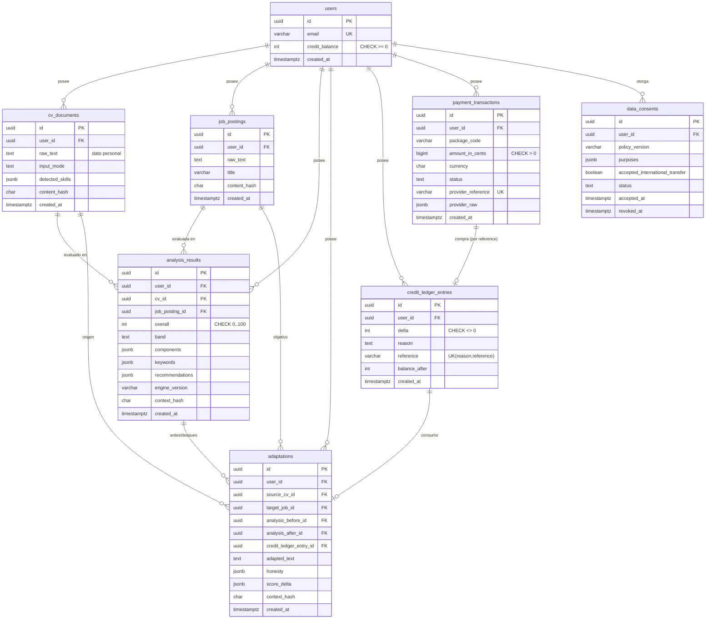

# Modelo de Datos — BuildCv (MVP CV/ATS)

> **Artefacto SDD:** `specs/001-mvp-cv-ats/data-model.md` — define las **entidades** del glosario canónico de `spec.md` con sus **tipos**, **claves**, **relaciones**, **índices**, **restricciones/validaciones** y **notas de EF Core / PostgreSQL**. Es el "CÓMO se estructuran los datos" que respalda `contracts/api-contract.md` y `tasks.md`, derivado de `spec.md` (QUÉ) y `research.md` (decisiones técnicas).
>
> **Idioma:** español (documentación) · identificadores de código en inglés.
> **Fecha base:** 2026-06-06 · **Stack persistencia (v1):** EF Core 9 + Npgsql + PostgreSQL.
> **Fuentes canónicas:** entidades, IDs FR/US y atributos provienen **sin cambios** de `spec.md` §4 y del INSUMO del motor de puntaje (DTOs en `BuildCv.Domain.Scoring`).
>
> **Regla rectora de este documento:**
> - **v0 (P0): NINGUNA entidad se persiste.** Todo el modelo de v0 vive **en memoria** como *records inmutables* del dominio; no hay `DbContext`, ni base de datos, ni migraciones (materializa FR-040, FR-041, NFR-001).
> - **v1 (P1):** se introduce persistencia (EF Core + PostgreSQL) para `Usuario`, `CV`, `Vacante`, `Resultado de Análisis`, `Adaptación`, `Movimiento de Crédito`, `Transacción de Pago` y `Consentimiento de Datos`, bajo consentimiento informado (FR-045, FR-046, FR-051, NFR-004, NFR-023).

---

## 1. Principios de modelado

1. **El puntaje y sus desgloses son `value objects` inmutables** (no entidades con identidad). En v0 son `record` de C# en memoria; en v1 se **persisten como `jsonb`** anidados en su entidad raíz (`Resultado de Análisis` / `Adaptación`). Nunca se normalizan en tablas relacionales: son fotos selladas por `EngineVersion`+`ContextHash`, no datos consultables campo a campo.
2. **Determinismo y reproducibilidad (FR-006, FR-013, FR-031):** cada `Resultado de Análisis` y cada `Adaptación` graban `EngineVersion`, `GazetteerVersion` y `ContextHash`. La comparación "62 → 89" solo es válida entre resultados con el **mismo `ContextHash`**.
3. **Separación dato/instrucción (FR-026):** los campos `RawText` de CV y Vacante son **datos opacos**; el modelo no les asigna semántica ejecutable.
4. **Privacidad por diseño (FR-040, NFR-001):** la persistencia es exclusiva de v1 y opt-in por consentimiento. Las columnas de contenido (`RawText`, `AdaptedText`) se marcan como **dato personal** (potencialmente sensible) para políticas de retención/supresión.
5. **Convención PostgreSQL:** `snake_case` para tablas y columnas (vía `EFCore.NamingConventions` → `UseSnakeCaseNamingConvention()`); claves primarias `uuid` generadas con **UUIDv7** (`Guid.CreateVersion7()`, .NET 10) para localidad de índice y orden temporal; marcas de tiempo en `timestamptz` (UTC).
6. **Auditoría inmutable:** `Movimiento de Crédito` es **append-only**; nunca se actualiza ni borra una fila de saldo, se agregan filas compensatorias.

---

## 2. Mapa de persistencia por hito (todas las entidades del glosario)

> Clasificación de **cada** entidad de `spec.md` §4: dónde vive y cómo se representa.

| # | Entidad (glosario canónico) | v0 | v1 | Representación |
|---|---|---|---|---|
| 1 | **CV (Hoja de Vida)** | En memoria (`CvDocument`) | **Tabla `cv_documents`** | Entidad persistida (v1) |
| 2 | **Vacante** | En memoria (`JobPosting`) | **Tabla `job_postings`** | Entidad persistida (v1) |
| 3 | **Requisito de Vacante** | En memoria (`Requirement` ⊂ `JobRequirementSet`) | `jsonb` dentro de `analysis_results` | Value object |
| 4 | **Coincidencia de Keyword** | En memoria (`MatchResult`) | `jsonb` dentro de `analysis_results` | Value object |
| 5 | **Componente de Puntaje** | En memoria (`ComponentScore`) | `jsonb` dentro de `analysis_results` | Value object |
| 6 | **Resultado de Análisis** | En memoria (`ScoreResult`) | **Tabla `analysis_results`** | Entidad persistida (v1), desglose en `jsonb` |
| 7 | **Recomendación** | En memoria (`Recommendation`) | `jsonb` dentro de `analysis_results` | Value object |
| 8 | **Adaptación** | En memoria (`Adaptation`) | **Tabla `adaptations`** | Entidad persistida (v1) |
| 9 | **Verificación de Honestidad** | En memoria (`HonestyVerdict`) | `jsonb` dentro de `adaptations` | Value object |
| 10 | **Delta de Mejora** | En memoria (`ScoreDelta`) | `jsonb` dentro de `adaptations` | Value object |
| 11 | **Sesión de Análisis** | En memoria (`AnalysisSession`) | **NUNCA persistida** | Contexto efímero (solo v0) |
| 12 | **Diccionario de Habilidades** | Recurso embebido (YAML) inmutable | Recurso embebido (YAML) inmutable | **No es tabla**; recurso versionado |
| 13 | **Usuario** | — (sin cuentas en v0) | **Tabla `users`** (ASP.NET Core Identity) | Entidad persistida (v1) |
| 14 | **Crédito** | — | Saldo en `users.credit_balance` + ledger | Value object derivado del ledger |
| 15 | **Movimiento de Crédito** | — | **Tabla `credit_ledger_entries`** | Entidad persistida (v1), append-only |
| 16 | **Transacción de Pago** | — | **Tabla `payment_transactions`** | Entidad persistida (v1) |
| 17 | **Consentimiento de Datos** | — | **Tabla `data_consents`** | Entidad persistida (v1) |

**Resumen:** v0 → **0 tablas**. v1 → **7 tablas de dominio** (`cv_documents`, `job_postings`, `analysis_results`, `adaptations`, `credit_ledger_entries`, `payment_transactions`, `data_consents`) + tablas de **ASP.NET Core Identity** (`users` = `AspNetUsers` extendida, roles, etc.). El **Diccionario de Habilidades** y los léxicos del motor son **recursos del repositorio**, no datos de BD en el MVP.

---

# PARTE A — Modelo en memoria (v0): NINGUNA entidad persistida

> v0 procesa todo en memoria y lo descarta al responder (FR-040, NFR-001). No hay `DbContext`. Las estructuras siguientes son **`record` inmutables** del dominio (`BuildCv.Domain.Scoring`), 100% testeables sin infraestructura. Los tipos coinciden con los DTOs del INSUMO del motor de puntaje.

## A.0 Sesión de Análisis (raíz efímera — solo v0)

`AnalysisSession` agrupa, **solo en memoria**, las referencias de una interacción: CV, Vacante, Resultado, Adaptación y Delta. **Jamás se serializa a disco ni a BD.** Vive durante el ciclo de una petición HTTP (o de la pestaña del navegador para el borrador local de FR-004); su `CancellationToken` corta el streaming y el gasto de IA (FR-028).

| Campo | Tipo C# | Notas |
|---|---|---|
| `SessionId` | `Guid` (UUIDv7) | Solo correlación de logs (metadato no sensible, NFR-002); no se persiste |
| `Cv` | `CvDocument` | Entrada en memoria |
| `Job` | `JobPosting` | Entrada en memoria |
| `Result` | `ScoreResult?` | Resultado del análisis determinista |
| `Adaptation` | `Adaptation?` | Adaptación generada por IA (si se solicitó) |
| `Delta` | `ScoreDelta?` | Comparación antes/después |

> **Honestidad de privacidad:** `SessionId` es el "identificador de contexto/traza" mencionado en NFR-002. Nunca acompaña al contenido del CV en logs.

## A.1 CV (Hoja de Vida) — `CvDocument`

| Atributo (glosario) | Campo C# | Tipo | Notas |
|---|---|---|---|
| texto/contenido | `RawText` | `string` | Validado: no vacío, longitud mín/máx (FR-002, FR-037) |
| modo de entrada | `Mode` | `InputMode` (`PastedText` \| `UploadedFile`) | Controla la medibilidad `m_c` del formato (FR-011) |
| secciones detectadas | `Sections` | `IReadOnlyList<DetectedSection>` | Derivadas por el motor (no entrada del usuario) |
| habilidades detectadas | `Skills` | `IReadOnlyList<DetectedSkill>` | Canónico + ubicación (`Placement`) |
| experiencias | `Experiences` | `IReadOnlyList<ExperienceItem>` | Viñetas, verbos, métricas (insumo de C3) |
| datos de contacto | `Contact` | `ContactInfo` (`Email?`, `Phone?`) | Insumo de compuerta C2 (FR-012) |

```csharp
public sealed record CvDocument(string RawText, InputMode Mode);   // entrada cruda
public enum InputMode { PastedText, UploadedFile }                  // v0: siempre PastedText
// El "CvAnalysis" derivado (secciones/skills/experiencias/contacto) lo produce el motor.
```

> En **v0** solo existe `Mode = PastedText` ⇒ `m_{C4} = 0.5` (formato parcialmente medible, FR-011). `UploadedFile` se habilita en v1 con `ICvParser` (FR-054, FR-055) ⇒ `m_{C4} = 1.0`.

## A.2 Vacante — `JobPosting`

| Atributo | Campo C# | Tipo | Notas |
|---|---|---|---|
| texto/contenido | `RawText` | `string` | Validado igual que el CV (FR-002) |
| secciones detectadas | (derivadas) | `IReadOnlyList<JobSection>` | requisitos / responsabilidades / deseables / título → `RequirementSection` |

```csharp
public sealed record JobPosting(string RawText);
public enum RequirementSection { MustHave, Responsibility, NiceToHave, Title }
```

## A.3 Requisito de Vacante — `Requirement` (⊂ `JobRequirementSet`)

| Atributo | Campo C# | Tipo | Notas |
|---|---|---|---|
| término canónico | `CanonicalId`, `Display` | `string` | Resuelto contra el Diccionario de Habilidades |
| categoría | `Category` | `SkillCategory` (`HardSkill` \| `Tool` \| `SoftSkill` \| `GenericKeyword`) | `base_category` del peso (FR-014) |
| sección de origen | `Section` | `RequirementSection` | `section_multiplier` del peso |
| importancia/peso | `Weight` | `double` | `w_i` clamped a `[0.2, 2.0]` (FR-014) |

```csharp
public sealed record Requirement(string CanonicalId, string Display,
    SkillCategory Category, RequirementSection Section, double Weight);
public sealed record JobRequirementSet(
    IReadOnlyList<Requirement> Requirements, string ContextHash);   // ContextHash sella la extracción
```

> El `ContextHash` de `JobRequirementSet` es la **clave de reproducibilidad** del recálculo (FR-031): el CV adaptado se re-puntúa con el mismo set de requisitos.

## A.4 Coincidencia de Keyword — `MatchResult`

| Atributo | Campo C# | Tipo | Notas |
|---|---|---|---|
| requisito asociado | `Requirement` | `Requirement` | — |
| nivel de coincidencia | `Tier` | `MatchTier` (`None`\|`Exact`\|`Alias`\|`Lemma`\|`Related`\|`Fuzzy`) | Cascada de 4 niveles (FR-015) |
| ubicación en el CV | `Placement` | `Placement` (`Prominent`\|`Buried`\|`NotFound`) | Factor de ubicación (FR-018) |
| crédito otorgado | `Credit` | `double` ∈ `[0,1]` | `tierCredit × placementFactor` |
| evidencia | `EvidenceSnippet` | `string?` | Fragmento del CV donde se halló |

```csharp
public sealed record MatchResult(Requirement Requirement, MatchTier Tier,
    Placement Placement, double Credit, string? EvidenceSnippet);
public enum MatchTier { None, Exact, Alias, Lemma, Related, Fuzzy }
public enum Placement { Prominent, Buried, NotFound }
```

## A.5 Componente de Puntaje — `ComponentScore`

| Atributo | Campo C# | Tipo | Notas |
|---|---|---|---|
| identificador del componente | `Id` | `ComponentId` (`Match`\|`Structure`\|`Achievements`\|`Format`\|`Length`) | C1–C5 (FR-007) |
| subpuntaje | `SubScore` | `double` ∈ `[0,1]` | — |
| peso | `Weight` | `double` | C1:0.45·C2:0.20·C3:0.20·C4:0.10·C5:0.05 |
| cobertura de medición | `Measurability` | `double` ∈ `[0,1]` | `m_c`; v0 `m_{C4}=0.5` (FR-011) |
| nivel de confianza | `Confidence` | `double` ∈ `[0,1]` | — |
| resumen explicativo | `Summary` | `string` | Atribución a regla concreta (FR-008) |
| (anexo) | `Recommendations` | `IReadOnlyList<Recommendation>` | Recomendaciones que mejoran este componente |

```csharp
public enum ComponentId { Match, Structure, Achievements, Format, Length }
public sealed record ComponentScore(ComponentId Id, double SubScore, double Weight,
    double Measurability, double Confidence, string Summary,
    IReadOnlyList<Recommendation> Recommendations);
```

## A.6 Resultado de Análisis — `ScoreResult` (raíz del desglose)

| Atributo | Campo C# | Tipo | Notas |
|---|---|---|---|
| puntaje global | `Overall` | `int` ∈ `[0,100]` | Entero, redondeo half-up (FR-005) |
| banda | `Band` | `ScoreBand` (`Bajo`\|`Medio`\|`Bueno`\|`Fuerte`) | UI; el número manda (FR-010) |
| aviso de encuadre honesto | `Disclaimer` | `string` | "Coincidencia + legibilidad, no ATS oficial" (FR-009) |
| componentes de puntaje | `Components` | `IReadOnlyList<ComponentScore>` | C1–C5 (FR-007) |
| análisis de keywords | `Keywords` | `KeywordAnalysis` | presentes/faltantes/parciales (FR-019) |
| recomendaciones | `Recommendations` | `IReadOnlyList<Recommendation>` | Ordenadas por impacto (FR-021) |
| problemas de formato | `FormatIssues` | `IReadOnlyList<FormatIssue>` | severidad + descripción |
| versión del motor | `EngineVersion` | `string` | p. ej. `scoring-1.3.0+gz-2.1` (FR-013) |
| identificador de contexto | `ContextHash` | `string` | Sella la comparación (FR-031) |

```csharp
public sealed record ScoreResult(
    int Overall, ScoreBand Band, string Disclaimer,
    IReadOnlyList<ComponentScore> Components,
    KeywordAnalysis Keywords,
    IReadOnlyList<Recommendation> Recommendations,
    IReadOnlyList<FormatIssue> FormatIssues,
    string EngineVersion, string ContextHash);
public enum ScoreBand { Bajo, Medio, Bueno, Fuerte }

public sealed record KeywordAnalysis(
    IReadOnlyList<MatchedKeyword> Matched,
    IReadOnlyList<MissingKeyword> Missing,
    IReadOnlyList<PartialKeyword> RelatedPartial);
public sealed record MatchedKeyword(string Canonical, MatchTier Tier, string WhereFound);
public sealed record MissingKeyword(string Canonical, double Importance, string Advice, string Reason);
public sealed record PartialKeyword(string Req, string YouHave, double Credit);
public sealed record FormatIssue(string Severity, string Issue);  // "warn" | "info"
```

## A.7 Recomendación — `Recommendation`

| Atributo | Campo C# | Tipo | Notas |
|---|---|---|---|
| acción descrita | `Action` | `string` | Texto accionable |
| tipo | `Type` | `RecommendationType` (`Surface`\|`Rewrite`\|`AddMetric`\|`FixFormat`\|`Learn`) | resurgir/reescribir/añadir métrica/corregir formato/aprender (FR-022) |
| componente afectado | `Component` | `ComponentId` | C1–C5 |
| impacto estimado | `EstimatedGain` | `int` | Recálculo marginal del Overall (FR-021) |
| si implica invención | `Invents` | `bool` | `false` para arreglos ejecutables; `true` solo en "brechas reales" tipo `Learn` (FR-022, FR-024) |
| nota de honestidad | `HonestyNote` | `string?` | p. ej. "no lo inventes" |

```csharp
public sealed record Recommendation(string Action, RecommendationType Type,
    ComponentId Component, int EstimatedGain, bool Invents, string? HonestyNote);
public enum RecommendationType { Surface, Rewrite, AddMetric, FixFormat, Learn }
```

## A.8 Adaptación — `Adaptation`

| Atributo | Campo C# | Tipo | Notas |
|---|---|---|---|
| texto adaptado | `AdaptedText` | `string` | Solo reordena/reescribe/prioriza lo existente (FR-023, FR-024) |
| CV origen | `SourceCv` | `CvDocument` (ref. en memoria) | — |
| vacante objetivo | `TargetJob` | `JobPosting` (ref. en memoria) | — |
| resultado de verificación de honestidad | `Honesty` | `HonestyVerdict` | FR-025, FR-029 |
| metadatos de generación | `Generation` | `GenerationMetadata` | modelo, versión de prompt (`sha256`), tokens, latencia |

```csharp
public sealed record Adaptation(string AdaptedText, HonestyVerdict Honesty,
    GenerationMetadata Generation, string EngineVersion, string ContextHash);
public sealed record GenerationMetadata(string Model, string PromptVersion,
    string PromptSha256, int InputTokens, int OutputTokens, int LatencyMs);
```

> **Defensa anti-invención (FR-024, FR-025):** la adaptación no crea entidades nuevas; la verificación posterior compara entidades del CV adaptado contra el original.

## A.9 Verificación de Honestidad — `HonestyVerdict`

| Atributo | Campo C# | Tipo | Notas |
|---|---|---|---|
| estado | `Status` | `HonestyStatus` (`NoInvention` \| `Warning`) | sin invención / advertencia (FR-029) |
| términos potencialmente nuevos | `PotentiallyNewTerms` | `IReadOnlyList<string>` | Términos no respaldados por el original (FR-025) |
| nota explicativa | `Note` | `string` | Mensaje para el usuario |

```csharp
public sealed record HonestyVerdict(HonestyStatus Status,
    IReadOnlyList<string> PotentiallyNewTerms, string Note);
public enum HonestyStatus { NoInvention, Warning }
```

## A.10 Delta de Mejora — `ScoreDelta`

| Atributo | Campo C# | Tipo | Notas |
|---|---|---|---|
| puntaje origen | `From` | `int` | Antes |
| puntaje destino | `To` | `int` | Después |
| diferencia por componente | `ByComponent` | `IReadOnlyList<ComponentDelta>` | `{ Component, Delta }` |
| requisitos resueltos | `Resolved` | `IReadOnlyList<string>` | FR-032 |
| requisitos aún faltantes | `StillMissing` | `IReadOnlyList<string>` | FR-032 |
| (guardarraíl) | `PossibleInventions` | `IReadOnlyList<string>` | Skills nuevas no trazables al original (FR-025) |

```csharp
public sealed record ScoreDelta(int From, int To,
    IReadOnlyList<ComponentDelta> ByComponent,
    IReadOnlyList<string> Resolved, IReadOnlyList<string> StillMissing,
    IReadOnlyList<string> PossibleInventions);
public sealed record ComponentDelta(ComponentId Component, int Delta);
```

> **Validez (FR-031):** `Compare(before, after)` exige `before.ContextHash == after.ContextHash`; de lo contrario el delta se rechaza por incomparable.

## A.11 Diccionario de Habilidades — recurso, NO tabla

El **Diccionario de Habilidades** (gazetteer + léxicos) **no es una entidad de base de datos** en el MVP: es un **recurso embebido versionado** (`gazetteer.vMAJOR.MINOR`, YAML) cargado por un adaptador en `Infrastructure` **fuera del dominio** e inyectado como datos inmutables (`ISkillGazetteer`). Razones: debe ser determinista, versionable en Git, revisable por humanos y sellado en cada `ScoreResult` (FR-013).

| Atributo (glosario) | Forma en el recurso | Notas |
|---|---|---|
| versión | `gazetteerVersion` | Grabada en `EngineVersion` del resultado |
| entradas (término canónico, categoría, alias) | `SkillEntry { Id, Canonical, Category, Aliases }` | YAML |
| relaciones (implica, relacionada, ascendente) | `Implies`, `Related`, `Broader` | Crédito por nivel (FR-018) |
| exclusiones de confundibles | `ConfusableWith` (simétrico) | Anti falso positivo `java ⇎ javascript` (FR-017) |

```csharp
public interface ISkillGazetteer {
    bool TryResolve(string normalizedToken, out SkillEntry entry);
    IReadOnlyList<string> Related(string canonicalId);
    bool AreConfusable(string a, string b);
}
public sealed record SkillEntry(string Id, string Canonical, SkillCategory Category,
    IReadOnlyList<string> Implies, IReadOnlyList<string> Broader);
```

> **Futuro (no MVP):** si se requiere curación vía panel admin, el gazetteer podría migrar a tablas (`skill_entries`, `skill_aliases`, `skill_relations`, `skill_confusables`). Hasta entonces permanece como recurso del repo para preservar determinismo y revisión por PR.

---

# PARTE B — Modelo persistido (v1): EF Core + PostgreSQL

> Se introduce `BuildCvDbContext` en `Infrastructure/Persistence`. Toda persistencia de datos personales requiere `Consentimiento de Datos` vigente (FR-051, NFR-004, NFR-024). Las entidades de v0 (CV, Vacante) ahora pueden **guardarse** para el historial (FR-045); los desgloses de puntaje se persisten como `jsonb`.

## B.0 Convenciones de mapeo de tipos (C# → EF Core → PostgreSQL)

| Tipo C# | Conversión EF Core | Tipo PostgreSQL (Npgsql) | Uso en el modelo |
|---|---|---|---|
| `Guid` (UUIDv7) | (nativo) | `uuid` | Todas las PK/FK |
| `string` (texto largo) | (nativo) | `text` | `raw_text`, `adapted_text` |
| `string` (acotado) | `HasMaxLength(n)` | `varchar(n)` | `package_code`, `provider_reference` |
| `enum` | `HasConversion<string>()` | `text` + `CHECK` de valores | `Mode`, `Status`, `Band`, `Reason` |
| `int` | (nativo) | `integer` | `overall`, `credit_balance`, `delta` |
| `long` | (nativo) | `bigint` | `amount_in_cents` |
| `bool` | (nativo) | `boolean` | `accepted_international_transfer` |
| `DateTimeOffset` | (nativo, UTC) | `timestamptz` | Todas las marcas `*_at` |
| `record`/value object | `OwnsOne(...).ToJson()` | `jsonb` | Desgloses de puntaje, honestidad, delta, metadatos |
| `IReadOnlyList<string>` | `HasConversion` (JSON) | `jsonb` (o `text[]`) | `purposes`, `potentially_new_terms` |
| hash SHA-256 | `HasMaxLength(64)` | `char(64)` (hex) | `content_hash`, `context_hash` |
| concurrencia | `UseXminAsConcurrencyToken()` | `xmin` (sistema) | Filas mutables (saldo, estado de pago) |

**Decisiones transversales:**
- **Enums como `text` + `CHECK`** (vía `HasConversion<string>()`) en lugar de enums nativos de PostgreSQL: legible en SQL, sin fricción de migración al añadir valores; el `CHECK` documenta el dominio.
- **Desgloses de puntaje como `jsonb` con `.ToJson()`** (EF Core 8/9 *owned-to-json*): el `ScoreResult`/`ScoreDelta` es una foto inmutable; `jsonb` permite indexación GIN si en el futuro se consulta, sin normalizar value objects sin identidad.
- **Dinero en `bigint` de centavos** (`amount_in_cents`): Wompi opera en centavos (`$95.000 → 9500000`); evita errores de `decimal`/redondeo y coincide con el proveedor. Visualización = `/100`.
- **Timestamps `timestamptz` en UTC** con `HasDefaultValueSql("now()")` o asignación en aplicación; `DateTimeOffset` para no perder zona.
- **Soft-delete / retención:** las entidades de contenido personal soportan supresión real (`DELETE`) para cumplir ARCO (FR-052); no se usa soft-delete que retenga el contenido.

---

## B.1 Usuario — tabla `users` (ASP.NET Core Identity)

`ApplicationUser : IdentityUser<Guid>` extiende `AspNetUsers`. ASP.NET Core Identity aporta el esquema base (`users`, `roles`, `user_roles`, `user_claims`, `user_logins`, `user_tokens`).

| Atributo (glosario) | Columna | Tipo PG | Restricción / nota |
|---|---|---|---|
| identidad | `id` | `uuid` PK | UUIDv7 |
| (Identity) | `email`, `normalized_email` | `varchar(256)` | **Único** (índice de Identity sobre `normalized_email`) |
| medio de autenticación | `password_hash`, `*_login` | — | Gestionado por Identity (Identity + JWT, ver D03/research) |
| saldo de créditos | `credit_balance` | `integer` | **`CHECK (credit_balance >= 0)`**; denormalizado para lectura rápida (ver B.5) |
| fecha de registro | `created_at` | `timestamptz` | `DEFAULT now()` |
| estado de consentimiento | (derivado de `data_consents`) | — | Se consulta el `data_consent` vigente (B.8) |

**Claves/relaciones:** PK `id`. Es la **raíz de agregación** de los datos del usuario: 1—* `cv_documents`, `job_postings`, `analysis_results`, `adaptations`, `credit_ledger_entries`, `payment_transactions`, `data_consents`.

**Índices:** `IX_users_normalized_email` (único, de Identity).

**Restricciones:** `CHECK (credit_balance >= 0)`; `email` no nulo.

**Notas EF Core:**
- `IdentityDbContext<ApplicationUser, IdentityRole<Guid>, Guid>`; configuración de Identity vía su propio juego de migraciones.
- `credit_balance` con `concurrency token (xmin)` para evitar condiciones de carrera al consumir/recargar (ver B.5).
- **Consentimiento previo (FR-051):** el alta de usuario y el guardado de contenido exigen un `data_consents` vigente; se valida en `Application`, no por FK (un usuario existe antes de aceptar políticas extendidas).

---

## B.2 CV (Hoja de Vida) — tabla `cv_documents`

| Atributo | Columna | Tipo PG | Restricción / nota |
|---|---|---|---|
| identidad | `id` | `uuid` PK | UUIDv7 |
| dueño | `user_id` | `uuid` FK → `users.id` | `ON DELETE CASCADE` |
| texto/contenido | `raw_text` | `text` | **Dato personal/sensible**; `CHECK (char_length(raw_text) BETWEEN 1 AND 20000)` (FR-002, FR-037) |
| modo de entrada | `input_mode` | `text` | `HasConversion<string>()`; `CHECK IN ('PastedText','UploadedFile')` |
| etiqueta | `label` | `varchar(120)` | Nombre amigable en el historial |
| secciones detectadas | `detected_sections` | `jsonb` | Snapshot del análisis (no entrada del usuario) |
| habilidades detectadas | `detected_skills` | `jsonb` | `[{ canonical, placement }]` |
| datos de contacto | `contact` | `jsonb` | `{ email?, phone? }` (owned `ToJson`) |
| hash de contenido | `content_hash` | `char(64)` | SHA-256; dedup e idempotencia de re-análisis |
| fecha | `created_at` | `timestamptz` | `DEFAULT now()` |

**Claves/relaciones:** PK `id`; FK `user_id`. Referenciada por `adaptations.source_cv_id` y `analysis_results.cv_id`.

**Índices:** `IX_cv_documents_user_id_created_at` (`user_id`, `created_at DESC`) para el historial; `IX_cv_documents_content_hash` (no único: el mismo CV puede reusarse).

**Restricciones:** longitud de `raw_text` (espejo de la validación FR-002); `input_mode` acotado.

**Notas EF Core:** `OwnsOne(c => c.Contact).ToJson()`; `detected_sections`/`detected_skills` como propiedades `jsonb` vía conversores JSON; `raw_text` etiquetado en metadatos de privacidad para la rutina de supresión (FR-052).

---

## B.3 Vacante — tabla `job_postings`

| Atributo | Columna | Tipo PG | Restricción / nota |
|---|---|---|---|
| identidad | `id` | `uuid` PK | UUIDv7 |
| dueño | `user_id` | `uuid` FK → `users.id` | `ON DELETE CASCADE` |
| texto/contenido | `raw_text` | `text` | `CHECK (char_length BETWEEN 1 AND 20000)` (FR-002) |
| título/cargo | `title` | `varchar(200)` | Derivado de la sección "Cargo/Título" |
| secciones detectadas | `detected_sections` | `jsonb` | requisitos/responsabilidades/deseables/título |
| hash de contenido | `content_hash` | `char(64)` | SHA-256 |
| fecha | `created_at` | `timestamptz` | `DEFAULT now()` |

**Claves/relaciones:** PK `id`; FK `user_id`. Referenciada por `adaptations.target_job_id` y `analysis_results.job_posting_id`.

**Índices:** `IX_job_postings_user_id_created_at` (`user_id`, `created_at DESC`).

**Notas EF Core:** análogo a `cv_documents`; sin datos de contacto.

---

## B.4 Resultado de Análisis — tabla `analysis_results`

> Persiste la **foto sellada** de un `ScoreResult` (FR-045). Los value objects (componentes, keywords, recomendaciones, problemas de formato, requisitos extraídos, coincidencias) se guardan como `jsonb`; el motor sigue siendo la única fuente del número (NFR-021).

| Atributo | Columna | Tipo PG | Restricción / nota |
|---|---|---|---|
| identidad | `id` | `uuid` PK | UUIDv7 |
| dueño | `user_id` | `uuid` FK → `users.id` | `ON DELETE CASCADE` |
| CV evaluado | `cv_id` | `uuid` FK → `cv_documents.id` | `ON DELETE CASCADE` |
| vacante evaluada | `job_posting_id` | `uuid` FK → `job_postings.id` | `ON DELETE CASCADE` |
| puntaje global | `overall` | `integer` | **`CHECK (overall BETWEEN 0 AND 100)`** (FR-005) |
| banda | `band` | `text` | `HasConversion<string>()`; `CHECK IN ('Bajo','Medio','Bueno','Fuerte')` |
| aviso encuadre honesto | `disclaimer` | `text` | FR-009 |
| componentes de puntaje | `components` | `jsonb` | `ComponentScore[]` (C1–C5) |
| análisis de keywords | `keywords` | `jsonb` | `{ matched[], missing[], relatedPartial[] }` |
| coincidencias (detalle) | `matches` | `jsonb` | `MatchResult[]` (evidencia, tier, placement) |
| requisitos extraídos | `requirements` | `jsonb` | `JobRequirementSet` (para reproducir el contexto) |
| recomendaciones | `recommendations` | `jsonb` | `Recommendation[]` (ordenadas por impacto) |
| problemas de formato | `format_issues` | `jsonb` | `FormatIssue[]` |
| versión del motor | `engine_version` | `varchar(50)` | p. ej. `scoring-1.3.0+gz-2.1` (FR-013) |
| versión del léxico | `gazetteer_version` | `varchar(20)` | FR-013 |
| identificador de contexto | `context_hash` | `char(64)` | Clave de comparación (FR-031) |
| fecha | `created_at` | `timestamptz` | `DEFAULT now()` |

**Claves/relaciones:** PK `id`; FK `user_id`, `cv_id`, `job_posting_id`. Un `analysis_result` "antes" y otro "después" pueden compartir `context_hash` (mismo set de requisitos) y vincularse a una `adaptation`.

**Índices:** `IX_analysis_results_user_id_created_at` (historial); `IX_analysis_results_context_hash` (emparejar antes/después).

**Restricciones:** `overall ∈ [0,100]`; `band` acotada.

**Notas EF Core:** todos los desgloses con `OwnsOne(...).ToJson()` o propiedades `jsonb` con conversor `System.Text.Json`. **No** se normalizan: son value objects inmutables sellados; consultarlos campo a campo no es un caso de uso del MVP (si lo fuera, `GIN` sobre `jsonb`).

---

## B.5 Crédito — saldo (`users.credit_balance`) + ledger

> El glosario define **Crédito** con atributos `saldo`, `regla de consumo (1 adaptación = 1 crédito)` y `caducidad (sin caducidad por defecto)`. **Diseño:** el Crédito **no es una tabla propia**; se materializa como:
> 1. **Saldo denormalizado** en `users.credit_balance` (`integer`, lectura O(1) para mostrar "te quedan N").
> 2. **Fuente de verdad auditable** en `credit_ledger_entries` (B.6): el saldo es `Σ delta`.

**Regla de consumo (FR-046):** crear una `Adaptación` ejecuta, en **una transacción**, (a) `INSERT` de un `credit_ledger_entry` con `delta = -1, reason = 'Consumption'` y (b) `UPDATE users SET credit_balance = credit_balance - 1`. La concurrencia se protege con el token `xmin` sobre `users` (evita doble consumo) y un `CHECK (credit_balance >= 0)` que rechaza saldos negativos.

**Caducidad:** sin caducidad por defecto (no hay columna de expiración en el MVP; reservada para el futuro).

---

## B.6 Movimiento de Crédito — tabla `credit_ledger_entries` (libro mayor, append-only)

| Atributo | Columna | Tipo PG | Restricción / nota |
|---|---|---|---|
| identidad | `id` | `uuid` PK | UUIDv7 |
| dueño | `user_id` | `uuid` FK → `users.id` | `ON DELETE CASCADE` |
| variación | `delta` | `integer` | `CHECK (delta <> 0)`; `>0` ingreso, `<0` consumo |
| motivo | `reason` | `text` | `HasConversion<string>()`; `CHECK IN ('Purchase','Gift','Consumption')` |
| referencia | `reference` | `varchar(80)` | `adaptation_id` (consumo) o `payment_transaction_id` (compra) |
| saldo resultante | `balance_after` | `integer` | Snapshot para auditoría/reconciliación |
| fecha | `created_at` | `timestamptz` | `DEFAULT now()` |

**Claves/relaciones:** PK `id`; FK `user_id`. **Append-only**: nunca `UPDATE`/`DELETE`.

**Índices:**
- `IX_credit_ledger_user_id_created_at` (`user_id`, `created_at`) — extracto de movimientos.
- **`UX_credit_ledger_reason_reference` (ÚNICO sobre `reason`, `reference`)** — **clave de idempotencia (FR-048):** garantiza que un mismo pago (`Purchase` + `transaction_id`) o una misma adaptación (`Consumption` + `adaptation_id`) **no acredite/consuma dos veces** ante reintentos de webhook o reenvíos.

**Restricciones:** `delta <> 0`; `reason` acotado.

**Notas EF Core:** entidad de solo inserción; el repositorio expone `AddEntry` y `GetBalance` (= `Σ delta`, validado contra `users.credit_balance`). La idempotencia se delega al índice único (atrapa el `INSERT` duplicado como violación de constraint → no-op).

---

## B.7 Transacción de Pago — tabla `payment_transactions`

| Atributo | Columna | Tipo PG | Restricción / nota |
|---|---|---|---|
| identidad | `id` | `uuid` PK | UUIDv7 |
| dueño | `user_id` | `uuid` FK → `users.id` | `ON DELETE RESTRICT` (no borrar usuario con pagos) |
| paquete | `package_code` | `varchar(40)` | p. ej. `starter_5` |
| monto en moneda local | `amount_in_cents` | `bigint` | `CHECK (amount_in_cents > 0)`; centavos COP (FR-047) |
| moneda | `currency` | `char(3)` | `DEFAULT 'COP'` |
| método | `method` | `varchar(40)` | PSE / Nequi / tarjeta / Bancolombia… |
| estado | `status` | `text` | `HasConversion<string>()`; `CHECK IN ('Pending','Approved','Declined','Voided','Error')` |
| referencia del proveedor | `provider_reference` | `varchar(120)` | **ÚNICO** (FR-048) |
| payload firmado | `provider_raw` | `jsonb` | Evento Wompi verificado (sin secretos) |
| créditos otorgados | `credits_granted` | `integer` | Del paquete; 0 hasta aprobación |
| fecha creación | `created_at` | `timestamptz` | `DEFAULT now()` |
| fecha actualización | `updated_at` | `timestamptz` | Tocada por el webhook |

**Claves/relaciones:** PK `id`; FK `user_id`. Al pasar a `Approved`, genera **un** `credit_ledger_entry` (`reason='Purchase'`, `reference=id`) en la misma transacción.

**Índices:**
- **`UX_payment_transactions_provider_reference` (ÚNICO)** — idempotencia y conciliación con el proveedor (FR-048).
- `IX_payment_transactions_user_id_status_created_at` — historial/estado.

**Restricciones:** `amount_in_cents > 0`; `status` acotado; `currency='COP'` por defecto.

**Notas EF Core:**
- **Concurrencia (`xmin`)** sobre la fila: las transiciones de estado por webhook son idempotentes y resistentes a reintentos (FR-048, NFR-007).
- **Acreditación solo tras confirmación firmada (FR-048):** el handler verifica la firma **antes** de tocar la BD, valida estado, y **solo entonces** inserta el ledger + actualiza saldo. **Nunca** se acreditan créditos por el `redirect-url` del navegador (regla dura de research D15).
- **Secretos fuera del cliente (FR-049, NFR-008):** la firma de integridad se genera server-side; `provider_raw` no almacena llaves.

---

## B.8 Consentimiento de Datos — tabla `data_consents`

| Atributo | Columna | Tipo PG | Restricción / nota |
|---|---|---|---|
| identidad | `id` | `uuid` PK | UUIDv7 |
| titular | `user_id` | `uuid` FK → `users.id` | `ON DELETE CASCADE` |
| versión de política aceptada | `policy_version` | `varchar(20)` | p. ej. `2026-06-01` (FR-053) |
| finalidades | `purposes` | `jsonb` | `string[]` de finalidades informadas |
| aceptación transferencia internacional | `accepted_international_transfer` | `boolean` | Envío del contenido al proveedor de IA (FR-051, NFR-024) |
| estado | `status` | `text` | `HasConversion<string>()`; `CHECK IN ('Active','Revoked')` |
| fecha aceptación | `accepted_at` | `timestamptz` | `DEFAULT now()` |
| fecha revocación | `revoked_at` | `timestamptz` (nullable) | Constancia de revocación (FR-052) |

**Claves/relaciones:** PK `id`; FK `user_id`. Un usuario puede tener varias filas (historial de versiones de política); a lo sumo **una `Active`**.

**Índices:**
- `IX_data_consents_user_id_status`.
- **`UX_data_consents_user_active` — índice único parcial** `WHERE status = 'Active'` (un consentimiento vigente por usuario).

**Restricciones:** `status` acotado; `revoked_at` requerido cuando `status='Revoked'` (validación de aplicación).

**Notas EF Core:**
- **Constancia inmutable (FR-052):** revocar **no** borra la fila; la marca `Revoked` + `revoked_at` (deja constancia). La supresión de datos del titular elimina contenido (`cv_documents`, etc.) pero conserva la traza de consentimiento conforme al principio de demostrabilidad.
- Índice único parcial vía `HasFilter("status = 'Active'")`.

---

## B.9 Desglose de puntaje persistido (resumen de columnas `jsonb`)

Coherencia con el motor: los value objects de la **Parte A** se serializan a `jsonb` sin pérdida. Forma canónica almacenada (alineada con `ScoreResult`):

```jsonc
// analysis_results.components  (jsonb)
[
  { "id": "Match",        "subScore": 0.703, "weight": 0.45, "measurability": 1.0,
    "confidence": 0.9, "summary": "Cumples 7 de 11 requisitos clave" },
  { "id": "Format",       "subScore": 0.65,  "weight": 0.10, "measurability": 0.5,
    "confidence": 0.6, "summary": "Evaluación parcial — sube tu archivo para análisis completo" }
]
// analysis_results.keywords  (jsonb)
{ "matched":        [ { "canonical": "EF Core", "tier": "Alias", "whereFound": "skills" } ],
  "missing":        [ { "canonical": "PostgreSQL", "importance": 1.0, "advice": "learn",
                        "reason": "La vacante lo pide en Requisitos" } ],
  "relatedPartial": [ { "req": "PostgreSQL", "youHave": "SQL Server", "credit": 0.40 } ] }
// adaptations.honesty  (jsonb)
{ "status": "NoInvention", "potentiallyNewTerms": [], "note": "Sin invención detectada" }
// adaptations.score_delta  (jsonb)
{ "from": 62, "to": 89,
  "byComponent": [ { "component": "Achievements", "delta": 15 }, { "component": "Match", "delta": 8 } ],
  "resolved": [ "ASP.NET Core", "Docker (surfaced)", "Pruebas unitarias (surfaced)" ],
  "stillMissing": [ "PostgreSQL", "Azure", "Microservicios" ],
  "possibleInventions": [] }
```

La tabla `adaptations` (v1) añade a A.8 las columnas: `id` (PK), `user_id` (FK), `source_cv_id` (FK→`cv_documents`), `target_job_id` (FK→`job_postings`), `analysis_before_id`/`analysis_after_id` (FK→`analysis_results`), `adapted_text` (`text`), `honesty` (`jsonb`), `score_delta` (`jsonb`), `generation_meta` (`jsonb`), `engine_version`, `context_hash` (`char(64)`), `credit_ledger_entry_id` (FK→`credit_ledger_entries`, el consumo), `created_at`. Índices: `IX_adaptations_user_id_created_at`, FK indexes sobre `source_cv_id`, `target_job_id`.

---

## 3. Diagrama Entidad-Relación (v1)

**Descripción de relaciones (cardinalidades):**
- `users` **1 — N** `cv_documents`, `job_postings`, `analysis_results`, `adaptations`, `credit_ledger_entries`, `payment_transactions`, `data_consents` (el usuario es la **raíz de agregación**; borrado en cascada del contenido, `RESTRICT` en pagos).
- `adaptations` **N — 1** `cv_documents` (`source_cv_id`) y **N — 1** `job_postings` (`target_job_id`).
- `adaptations` **N — 1** `analysis_results` dos veces (`analysis_before_id`, `analysis_after_id`); ambos resultados comparten `context_hash` (FR-031).
- `adaptations` **1 — 1** `credit_ledger_entries` (`credit_ledger_entry_id` = el consumo que la pagó, FR-046).
- `payment_transactions` **1 — 0..1** `credit_ledger_entries` (al aprobarse, `reason='Purchase'`, vinculado por `reference`).
- `analysis_results` **N — 1** `cv_documents` y **N — 1** `job_postings`.
- `credit_ledger_entries` y `payment_transactions` se enlazan **lógicamente** por `reference` (no FK física, para preservar el ledger append-only e idempotente).



---

## 4. Estrategia de migraciones

**v0 — sin migraciones.** No existe `DbContext` ni base de datos. El motor es un servicio de dominio puro; nada que migrar (FR-040, NFR-001). El **Diccionario de Habilidades** y los léxicos se versionan como **recursos del repositorio** (no por EF migrations); su versión se sella en cada resultado (FR-013).

**v1 — EF Core Code-First con Npgsql.**
1. **Proyecto y contexto:** `BuildCvDbContext : IdentityDbContext<ApplicationUser, IdentityRole<Guid>, Guid>` en `Infrastructure/Persistence`. Configuración por entidad con `IEntityTypeConfiguration<T>` (una clase por tabla), descubiertas con `ApplyConfigurationsFromAssembly`.
2. **Convenciones globales:** `optionsBuilder.UseNpgsql(...).UseSnakeCaseNamingConvention()`; `modelBuilder` aplica `UseXminAsConcurrencyToken()` a entidades mutables (`users`, `payment_transactions`).
3. **Migración inicial:** `dotnet ef migrations add InitialIdentityAndDomain` genera (a) tablas de Identity y (b) las 7 tablas de dominio. Conviene **separar** en dos migraciones (`AddIdentity`, `AddDomain`) para claridad de revisión.
4. **Aplicación de migraciones:**
   - **Producción:** NO `EnsureCreated()`. Generar script idempotente (`dotnet ef migrations script --idempotent`) y aplicarlo en el pipeline de despliegue, o `context.Database.Migrate()` controlado en arranque con bloqueo (advisory lock) para evitar carreras entre instancias.
   - **Local/dev:** `dotnet ef database update`.
5. **Pruebas de integración:** **Testcontainers (PostgreSQL real)**, no SQLite/InMemory (que no soportan `jsonb`/`xmin`/índices parciales). Cada suite aplica las migraciones reales sobre un contenedor efímero → valida `CHECK`, índices únicos e idempotencia del ledger.
6. **Datos semilla:** créditos de bienvenida (1–2 al registrarse, D20) vía lógica de aplicación en el alta, **no** en migración (depende del consentimiento). Sin seed de contenido personal.
7. **Compatibilidad hacia adelante:** enums almacenados como `text` ⇒ añadir un valor no requiere migración de tipo (solo actualizar el `CHECK` si se desea endurecer). Los desgloses `jsonb` evolucionan con la `engine_version`; resultados antiguos quedan sellados con su versión (no se migra contenido `jsonb`, se reinterpreta por versión).
8. **Reversibilidad:** cada migración con `Down` probado; los `jsonb` y columnas nuevas se agregan como nullable o con `DEFAULT` para despliegues sin downtime.

---

## 5. Privacidad, retención y seguridad en el modelo (trazabilidad)

| Aspecto | Implementación en el modelo | FR / NFR |
|---|---|---|
| v0 no persiste | Sin `DbContext`; todo en `AnalysisSession` efímera | FR-040, FR-041, NFR-001 |
| Logs sin contenido | Solo `SessionId`/metadatos; nunca `raw_text` en logs | FR-041, NFR-002 |
| Minimización al proveedor IA | Se envía solo `raw_text` necesario; metadatos de generación no guardan el prompt completo con PII | FR-043, NFR-003 |
| Consentimiento previo (v1) | `data_consents` vigente requerido antes de persistir | FR-051, NFR-024 |
| Derechos ARCO (v1) | `DELETE` real de `cv_documents`/`job_postings`/`adaptations`; `data_consents` deja constancia | FR-052, NFR-004 |
| Idempotencia de pagos | `UX_payment_transactions_provider_reference` + `UX_credit_ledger_reason_reference` | FR-048, NFR-007 |
| Secretos fuera del cliente | Firma generada server-side; `provider_raw` sin llaves | FR-049, NFR-008 |
| Reproducibilidad | `engine_version`, `gazetteer_version`, `context_hash` sellados | FR-006, FR-013, FR-031 |
| Cero invención | `adaptations.honesty` + `score_delta.possibleInventions` persistidos | FR-024, FR-025, FR-029 |

> **Nota de datos sensibles ([NECESITA ACLARACIÓN] de spec.md §7.3):** un `cv_documents.raw_text` puede contener datos sensibles (salud, afiliaciones). La columna está marcada como tal para que la política de retención/supresión de v1 los trate con base legal explícita; el MVP minimiza el riesgo persistiendo solo bajo consentimiento y permitiendo supresión real.

---

## 6. Trazabilidad entidad → requisitos

| Entidad | FR principales |
|---|---|
| CV / Vacante | FR-001, FR-002, FR-037, FR-040, FR-045, FR-054 |
| Requisito de Vacante | FR-014 |
| Coincidencia de Keyword | FR-015, FR-016, FR-017, FR-018 |
| Componente de Puntaje | FR-007, FR-008, FR-011 |
| Resultado de Análisis | FR-005, FR-006, FR-009, FR-010, FR-013, FR-019 |
| Recomendación | FR-021, FR-022 |
| Adaptación | FR-023, FR-024, FR-027, FR-033, FR-034 |
| Verificación de Honestidad | FR-025, FR-029 |
| Delta de Mejora | FR-031, FR-032 |
| Sesión de Análisis | FR-040, FR-004 |
| Diccionario de Habilidades | FR-013, FR-016, FR-017, FR-018 |
| Usuario | FR-044, FR-045 |
| Crédito / Movimiento de Crédito | FR-046 |
| Transacción de Pago | FR-047, FR-048, FR-049 |
| Consentimiento de Datos | FR-051, FR-052, FR-053 |

---

**Archivos relacionados:** `spec.md` (entidades canónicas §4, FR), `research.md` (D01 motor, D03 arquitectura, D11 parseo, D15 pagos, D17 legal), INSUMO del motor de puntaje (DTOs `BuildCv.Domain.Scoring`). Alimenta `contracts/api-contract.md` (formas JSON de request/response) y `tasks.md` (tareas de persistencia v1).
